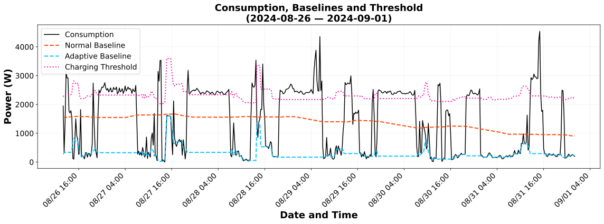
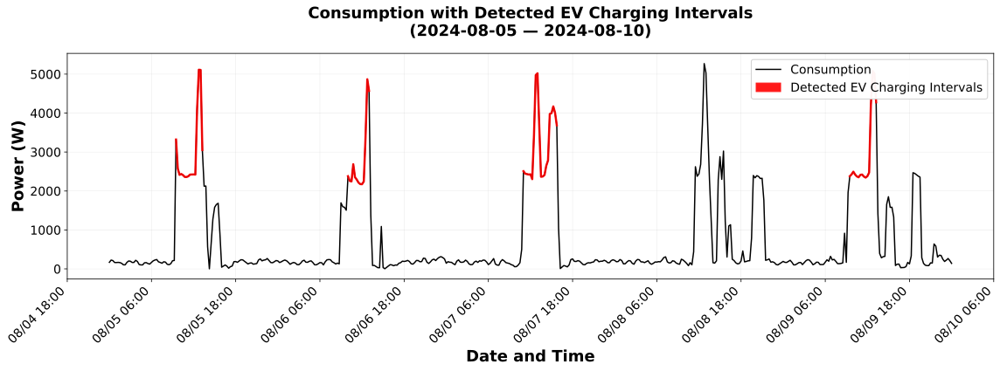
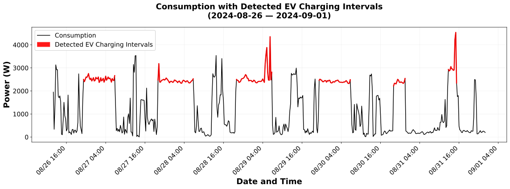

# Algorithmic Thresholding and Baseline Detection for EV Charging Identification

This repository contains the full implementation of the **Algorithmic Thresholding and Baseline Detection (ATBD)** method, a rule-based algorithm that automatically locates and timestamps electric vehicle (EV) charging sessions from aggregate household electricity consumption time series. Given only the total power draw measured at a supply point — no sub-metering, no smart plug, no vehicle telemetry — the code builds a dynamic power baseline for the household, derives a charging-specific detection threshold, and flags the time windows during which an EV is most likely actively charging.

---

## Context

The rapid spread of electric vehicles is reshaping residential electricity demand in ways that distribution grid operators currently have very limited visibility into. Standard metering infrastructure does not reveal whether a household owns an EV, let alone when or how it charges. This blind spot complicates infrastructure planning, makes it harder to anticipate local congestion, and prevents operators from unlocking the demand-flexibility potential that EVs can offer — for example, shifting charge timing to absorb surplus renewable generation or relieve network stress.

Identifying EV charging from aggregate consumption data is technically challenging because the charging signal is superimposed on the normal, variable activity of the household. Approaches based on machine learning or dedicated hardware can be effective but require either large labelled datasets or additional physical instrumentation. This work takes a different route: a lightweight, interpretable, purely algorithmic method that can run directly on the time series already collected by existing smart meters, without any prior labelled examples or extra sensors.

---

## Process and Methodology

The ATBD pipeline operates in two successive stages on 15-minute resolution power consumption data.

**Stage I** constructs a continuous, household-specific baseline that tracks normal background consumption while explicitly excluding periods of anomalously high load:

- A coarse reference level is first estimated from a centered rolling average spanning several days, providing an initial view of typical household activity.
- Data points are classified as *normal* only when they fall below this reference **and** their immediate neighbourhood confirms this is not an isolated dip — a consistency check that removes brief, atypical low-consumption moments.
- A finer adaptive baseline is then computed from the normal-period points alone, using a short centered rolling median (robust to residual outliers) that produces NaN gaps wherever the consumption was flagged as anomalous.
- Those gaps are filled conservatively via a *minimum-hold* interpolation that takes the lower of the nearest valid preceding and succeeding baseline values, ensuring the baseline does not overestimate consumption during charging events.
- A fixed empirical margin of **2 000 W** is added to this adaptive baseline to produce a dynamic charging threshold — the boundary a load must cross and sustain to be considered a candidate EV charging event.

**Stage II** converts the binary threshold-exceedance mask produced by Stage I into coherent charging intervals:

- A candidate session must begin with at least two consecutive threshold-exceeding points (seed condition).
- The seed is validated against a minimum-length requirement, a cap on the fraction of points allowed to dip below threshold within the window, and a limit on the maximum number of *consecutive* below-threshold points — rules that collectively reject cooking spikes, kettle boils, and other short high-power transients.
- Interior points are checked against a slightly relaxed version of the threshold to absorb minor measurement noise without prematurely terminating a real session.
- Valid seeds are expanded greedily in both directions: rightward as long as noise constraints are satisfied, and leftward to recover any preceding ramp-up that strictly exceeded the threshold.
- The search pointer advances past each confirmed interval, preventing overlapping detections.

---

## Results

Visual inspection of the algorithm's output over a representative multi-day window shows that the ATBD method successfully isolates a set of distinct, sustained high-power intervals that align closely with what is expected from residential EV charging behaviour. The detected sessions exhibit a stable, near-constant power draw in the 2 500–3 000 W range, consistent with typical single-phase AC charging at standard residential rates. Their timing is predominantly nocturnal — beginning in the late evening and extending through the night — matching widely reported overnight charging habits. Crucially, the algorithm discarded several mid-day power spikes that, despite reaching comparable magnitudes, lacked the sustained duration characteristic of a battery-charging cycle.

<p align="center">
  
  <br><em>Figure 1. Household consumption plotted alongside the normal baseline (orange), adaptive baseline (cyan), and derived charging threshold (pink). Points above the pink line are candidate EV charging moments.</em>
</p>

The method also reveals an inherent interpretative challenge that arises during periods of intense household activity. In certain mid-day windows, the algorithm correctly identifies sustained loads in the 2 500–5 000 W range that satisfy every temporal constraint. However, the timing of these detections coincides with peak daytime activity, where high-load appliances — such as HVAC systems, ovens, or laundry dryers — may be running simultaneously. In the absence of sub-metered ground truth, it is not possible to resolve whether such detections represent genuine EV charging or the concurrent operation of multiple appliances whose combined draw mimics a charging profile. This *source uncertainty* is an honest limitation of any aggregate-only approach and motivates future extensions incorporating shape recognition or frequency-domain features.

<p align="center">
  
  <br><em>Figure 2. ATBD output over a five-day observation period. The grey line is aggregate household consumption; red segments mark intervals classified as potential EV charging events.</em>
</p>

<p align="center">
  
  <br><em>Figure 3. Detected intervals during a different five-day window illustrating the interpretative challenge at mid-day when household appliance stacking can mimic an EV charging signature.</em>
</p>

---

## Data Availability

The residential consumption dataset used in this research is proprietary and cannot be released in full. A **3-day sample** (`inversor_data.csv`, covering 29–31 August 2024 at 15-minute resolution) is included in the repository to allow the code to be run end-to-end and its outputs to be reproduced. The sample is sufficient to exercise both the baseline computation and the interval detection stages and to generate figures equivalent to those reported in the paper.

---

## Running the Code

**Requirements:** Python 3.9+, `pandas >= 1.5`, `numpy >= 1.23`, `matplotlib >= 3.6`

With Conda (recommended):

```bash
conda env create -f environment.yml
conda activate atbd-ev-charging
python ev_charging_detection.py
```

With pip:

```bash
pip install pandas numpy matplotlib
python ev_charging_detection.py
```

Output figures are written to `figures/`. The `paper_figures/` folder contains the pre-generated figures used in the associated publication.

---

## Authors

**Aitor Díez Mateo** — Institute of Technology, Faculty of Engineering, University of Deusto, Bilbao, Spain · [aitor.diez@opendeusto.es](mailto:aitor.diez@opendeusto.es)

**Marion Perrin** — Energy Pool, Le Bourget du Lac, France · [marion.perrin@energy-pool.eu](mailto:marion.perrin@energy-pool.eu)

**Roberto Garay-Martinez** — Institute of Technology, Faculty of Engineering, University of Deusto, Bilbao, Spain · [roberto.garay@deusto.es](mailto:roberto.garay@deusto.es)

**Jose Ignacio García Quintanilla** — Institute of Technology, Faculty of Engineering, University of Deusto, Bilbao, Spain · [jigarcia@deusto.es](mailto:jigarcia@deusto.es)

---

## Acknowledgements

This work was carried out within the scope of the **Deusto Sustainable Research Group** at the University of Deusto.

---

## License

This project is released under the [MIT License](LICENSE).

---

*This work was supported by the European Union's Horizon Europe research and innovation programme under grant agreement No 101172968 (Project STUNNED). Views and opinions expressed are those of the authors only and do not necessarily reflect those of the European Union or the granting authority.*
